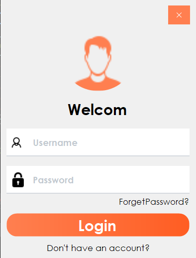
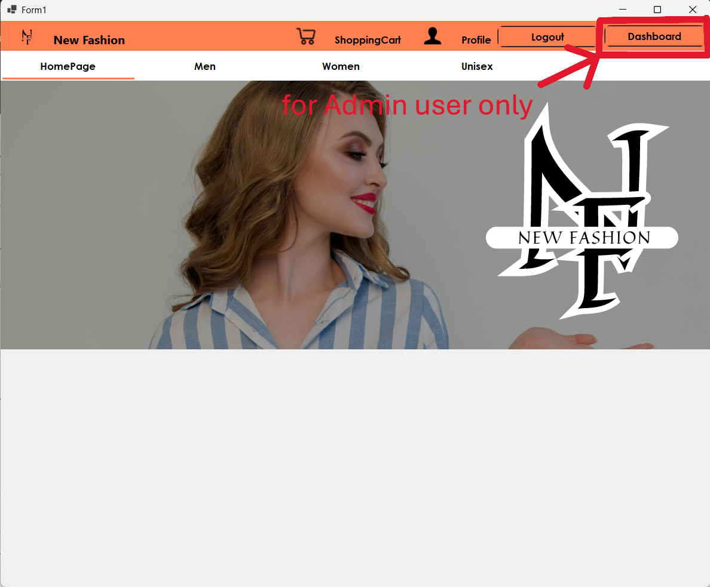
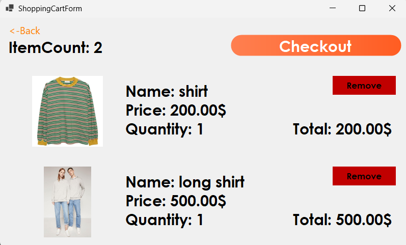
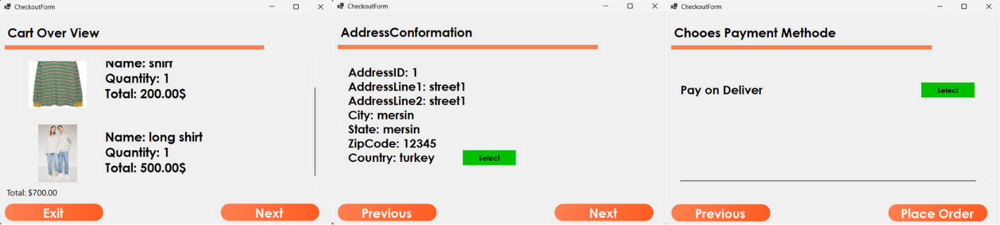
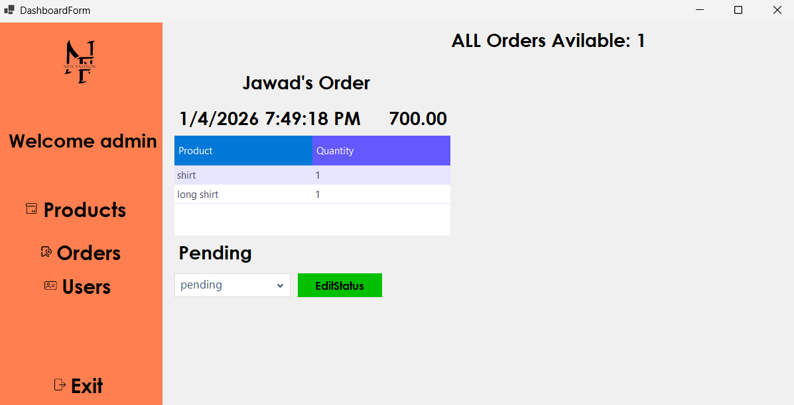

# 🛍️ Online Store Management System (OSMS)

**Student Name:** *Jawad Merwah*  
**Student Number:** *225060001*  

A **C# Desktop Application** with a graphical user interface for managing an online store system.  
The application supports **user authentication, product browsing, shopping carts, checkout, orders, and admin controls** 

The project follows a **model–driven structure**, managing real-life entities such as:

✔ Users  
✔ Products  
✔ Categories  
✔ Orders  
✔ Order Items  
✔ Shopping Cart Items  
✔ Shipping Addresses  

---

## 📸 Demo Screenshots & Video








### 🎥 Demo Video  
https://drive.google.com/file/d/13yu51Nye9VrhXL-l8a05PlC-1Y_Pu82L/view?usp=sharing

---

## 🛠️ Tech Stack

| Layer | Technology |
|------|-----------|
| Language | **C# (.NET Windows Forms)** |
| UI Library | **Guna.UI2 Framework** |
| Database | **Microsoft SQL Server** |
| Data Access | **ADO.NET (SqlConnection, SqlCommand)** |
| Hashing | **SHA-256 password hashing** |

---

## ⭐ Application Features

### 👤 User Module
- Register new users
- Secure login with password hashing (SHA-256)
- Profile dashboard
- Role-based access: **Admin / User**

---

### 🛒 Shopping Module
- Product browsing
- Categories
- Add items to cart
- Dynamic cart total calculation
- Remove from cart
- Save cart to DB

---

### 🚚 Checkout Module (3-Step Wizard)

1️⃣ **View Cart Summary**  
2️⃣ **Select Shipping Address**  
3️⃣ **Select Payment Method & Place Order**

A successful checkout creates:

✔ Order record  
✔ Order line items (OrderItems table)  
✔ Clears shopping cart  
✔ Refreshes user session  

---

### 📦 Orders & Order Items
- Each order stores:
  - User
  - Date
  - Total amount
  - Status
- Order Items store:
  - Product
  - Quantity
- Order Dashboard displays items in a **Guna2DataGridView**

---

### 🛠 Admin Features
- View all orders
- Change order status
- View users
- Manage products


---

### 🔐 Security
✔ Password hashing  
✔ No plaintext passwords  
✔ Role-based access  
✔ Validation checks  

---

## 🏗 System Architecture

The project follows a **Models / Controllers / Views / Helpers** layout:

```
OSMS/
 ├── Database/
 │   └── OnlineStoreDB.sql   
 ├── Models/           
 ├── Controllers/      
 ├── View/             
 │   ├── Component/
 │   └── Headers/
 ├── PublicClasses/    
 ├── Images/           
 ├── Properties/
 ├── Resources/
 ├── screens/
 ├── Form1.cs              
 ├── Form1.Designer.cs
 ├── Form1.resx
 ├── Program.cs
 ├── OSMS.csproj
 ├── OSMS.sln
 ├── README.md
 ├── .gitignore


```

---

# 📚 Model Classes (Core Domain Objects)


## 👤 `User`
Represents application users.

Properties include:
- UserID
- Username
- PasswordHash
- Role
- Email
- FirstName / LastName

Features:
✔ Registration  
✔ SHA-256 hashing  
✔ Login  
✔ Admin promotion  
✔ Uniqueness checks  

---

## 🛍 `Products`
Represents items available in the store.

Includes:
- Name
- Description
- Price
- Stock
- CategoryID
- ImagePath

Images are stored on disk — **only paths are stored in DB** (saves space)

---

## 🏷 `Categories`
Defines product classification.

Seeded initially:
- Men
- Women
- Unisex

---

## 🛒 `ShoppingCartItems`
Stores cart items per-user.

---

## 📦 `Orders`
Stores checkout results:

| Field | Meaning |
|------|--------|
| OrderID | PK |
| UserID | Customer |
| Date | When placed |
| TotalAmount | Sum total |
| OrderStatus | Pending / Shipped / etc |

---

## 📃 `OrderItems`
Stores each product inside the order.

This creates a **1-to-many parent–child relationship**:

```
Orders 1 — * OrderItems
```

This is how real ecommerce systems work ✔

---

## 🏠 `ShippingAddresses`
Users can store multiple delivery addresses.

---

# 🔑 Session Manager 

`SessionManager.cs` is a **static class that works like session storage in web apps.**

It stores:

```
UserID
User object
Role
Orders
ShoppingCartItems
ShippingAddresses
TotalOrderAmount
SelectedAddress
Payment Method
```

So the app always knows:

✔ which user is logged in  
✔ their cart  
✔ their orders  
✔ their permissions  

This reduces repeated DB calls and improves UI responsiveness.

There are helper functions like:

- SetUser(user)
- SetOrders(list)
- IncreaseTotalAmount()
- ResetTotalAmount()
- ClearSession()

This approach **mimics web session logic in a desktop environment** — which is a strong architectural decision.

---

# 🌱 Database Initializer & Seed Logic

The application includes database initialization logic to **automatically populate important default data when tables are empty**, including:

✔ Default product categories  
✔ Admin user (for first time runing)

This prevents:

❌ Broken UI  
❌ Empty dashboards  
❌ Null IDs  

and ensures first-time system stability.

---

# 🗄 Database Schema & ER Diagram


“The Products table also includes an ImagePath column used to store the relative path of the product image. This column is omitted in the diagram only for compact display.”

### Relationships include:

✔ User — * Orders  
✔ Orders — * OrderItems  
✔ Categories — * Products  
✔ User — * ShoppingCartItems  
✔ User — * ShippingAddresses  

---

# 🖥 GUI Overview

Built using **WinForms + Guna.UI2** for a modern look.

Core pages:

✔ Login / Register  
✔ Product List  
✔ Shopping Cart  
✔ Checkout Wizard  
✔ Order Dashboard  
✔ Admin Dashboard  
✔ Profile  
✔ Address Manager  

---

# ▶ Example Workflow

### 🛒 Buying a Product
1. Login  
2. Add product to cart  
3. Open Cart  
4. Click Checkout  
5. Select Address  
6. Select Payment Method  
7. Confirm Order  
8. Order + OrderItems saved  
9. Cart clears  
10. Redirect to profile  


---

# ⚙ How to Run the Project

### Requirements
- .NET Framework (WinForms)  
- SQL Server  
- Guna.UI2 Framework  

---

### Database Setup

1️⃣ Create database:

```
OnlineStoreDB
```

2️⃣ Run SQL schema script *(included in repo or generated via SSMS)*  

3️⃣ Ensure correct connection string in:

```
DatabaseConnection.cs
```

Example:

```csharp
Data Source=DESKTOP-0FDD8NU\JAWAD;
Initial Catalog=OnlineStoreDB;
Integrated Security=True;
```

4️⃣ Run the application  
Initializer seeds:

✔ categories  
✔ admin user : *(userName=admin, password=admin123)*  

---

# 🔐 Security Measures Implemented

✔ Passwords hashed using **SHA-256**  
✔ DB connection isolated in helper class  
✔ Role restrictions supported  
✔ SQL parameters prevent injection  
✔ Session controlled access  

---

# 🚧 Known Limitations

⚠ No online payment integration  
⚠ Admin must add products manually  
⚠ No multi-language UI  
⚠ Single-machine database  

---

# 🚀 Possible Future Enhancements

🔹 Export order invoices (PDF)  
🔹 Email notifications  
🔹 Image upload UI  
🔹 API or Web version  
🔹 Two-factor authentication  
🔹 Search & filter products  
🔹 Reporting dashboards  

---

# 👨‍💻 Author

**Jawad Merwah**  
SWE305 — Software Engineering  
Toros University  

---

# 🔗 GitHub Repository

https://github.com/Jawad-02/OSMS


---


---

## 🎉 Final Words

This project implements a **complete desktop ecommerce management system** with:

✔ Real-world model classes  
✔ Secure login  
✔ Database integration  
✔ Full graphical user interface  
✔ Order processing  
✔ Session-driven workflow  


---